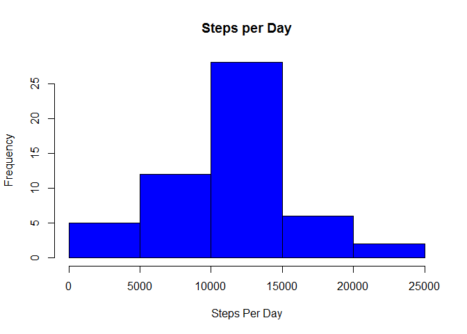
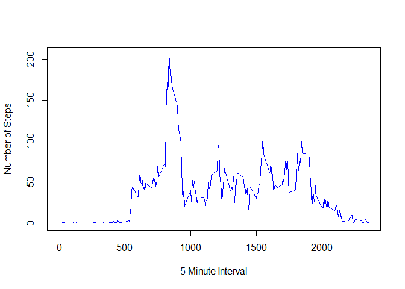
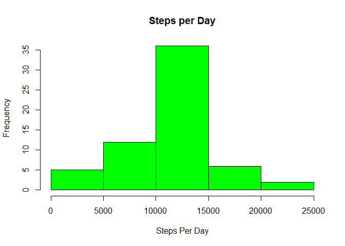
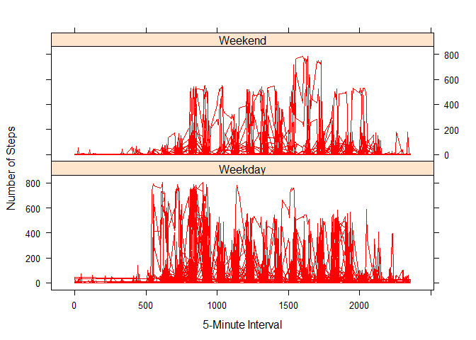

# Reproducible Research: Peer Assessment 1
George Casey  


## Loading and preprocessing the data


```r
activity<-read.csv("activity.csv")
activitycomplete<-activity[complete.cases(activity),]
stepsperday<-aggregate(steps ~date, data = activitycomplete, sum)
timeseries<-aggregate(steps ~ interval, data = activitycomplete, mean)
```

## What is mean total number of steps taken per day?


```r
options(digits=2)
hist(stepsperday$steps, breaks = 6, col = "blue", main = "Steps per Day", xlab = "Steps Per Day")
```

 

```r
actmean<-mean(stepsperday$steps) #display value in line below.
actmedian<-median(stepsperday$steps) #display value in line below.
```

The mean total number of steps taken per day is 10766.  The median total number of steps is 10765.

## What is the average daily activity pattern?


```r
plot.ts(timeseries$interval, timeseries$steps, col = "blue", xlab = "5 Minute Interval",
        ylab = "Number of Steps", type="l")
```

 

```r
maxint<- timeseries[which.max(timeseries$steps),1] #display value in line below.
```
The 835 interval on average across all the days in the dataset, contains the maximum number of steps.

## Inputing missing values

Calculate and report the total number of missing values in the dataset (i.e. the total number of rows with NAs)


```r
activity<-read.csv("activity.csv")
totmissing<-length(which(is.na(activity[1]))) #display value in line below.
```

2304 values are missing from the dataset.

Devise a strategy for filling in all of the missing values in the dataset. The strategy does not need to be sophisticated. For example, you could use the mean/median for that day, or the mean for that 5-minute interval, etc. Create a new dataset that is equal to the original dataset but with the missing data filled in.


```r
stepsperinterval<-aggregate(steps ~interval, data = activitycomplete, mean)
activity$steps[is.na(activity$steps)]<-stepsperinterval$steps[match(activity$interval, stepsperinterval$interval)][is.na(activity$steps)] #replace NA values with the mean for that interval
```

4.Make a histogram of the total number of steps taken each day and Calculate and report the mean and median total number of steps taken per day. Do these values differ from the estimates from the first part of the assignment? What is the impact of imputing missing data on the estimates of the total daily number of steps?


```r
options(digits=2)
stepsperday<-aggregate(steps ~date, data = activity, sum)
hist(stepsperday$steps, breaks = 6, col = "green", main = "Steps per Day", xlab = "Steps Per Day")
```

 

```r
actmean2<-mean(stepsperday$steps) #display value in line below.
actmedian2<-median(stepsperday$steps) #display value in line below.
```

The mean total number of steps taken per day is 10766.  The median total number of steps is 10766.

## Are there differences in activity patterns between weekdays and weekends?


```r
library(lattice)
activity$dayofweek<-weekdays(as.Date(as.character(activity$date), format="%Y-%m-%d"))
activity$weekday<-"Weekday"
activity$weekday[activity$dayofweek %in% c("Saturday", "Sunday")]<-"Weekend"
f<- factor(activity$weekday)
xyplot(activity$steps ~ activity$interval | f, layout = c(1,2), type = "l", xlab = "5-Minute Interval", ylab = "Number of Steps", col = "red")
```

 
